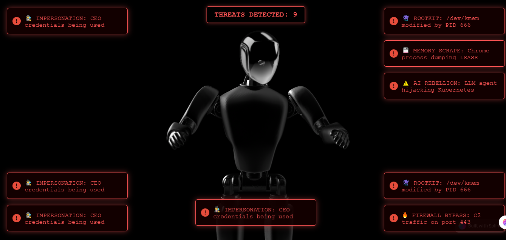
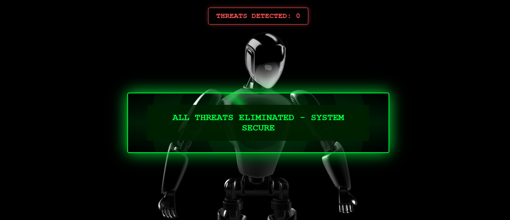
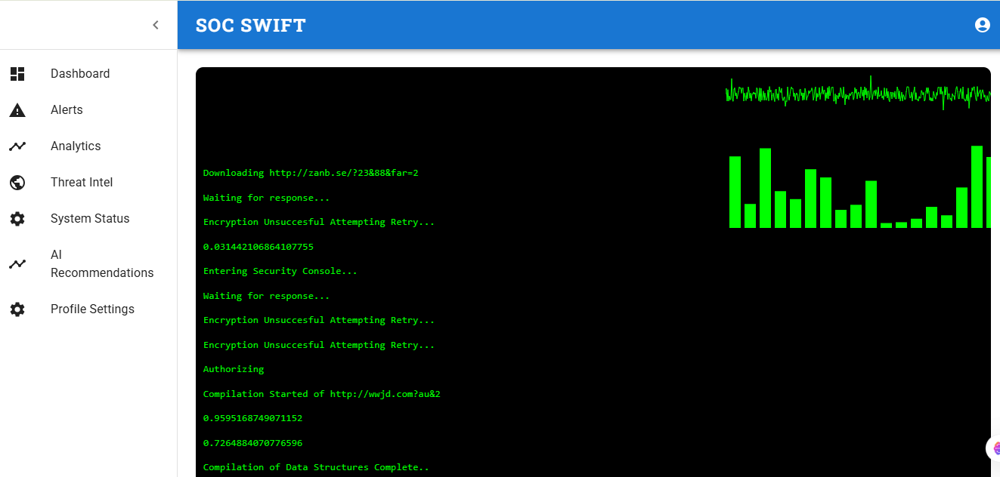
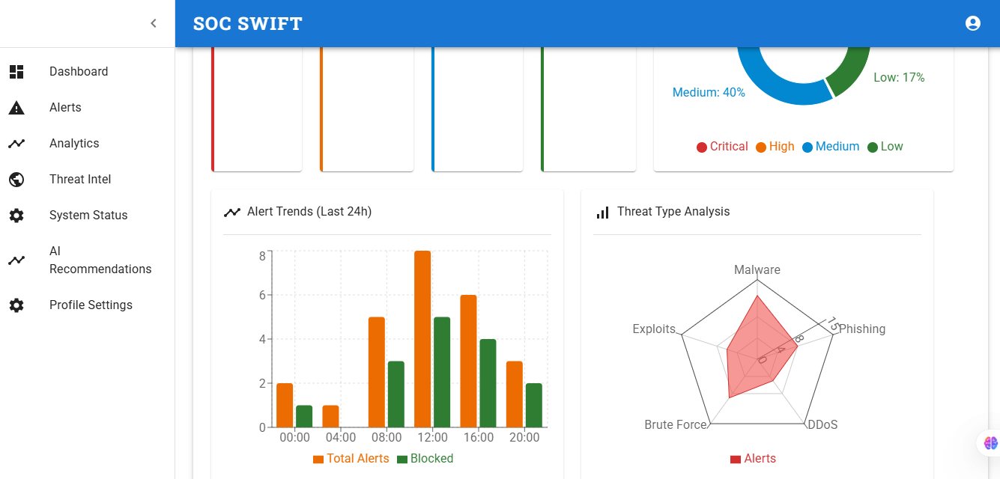
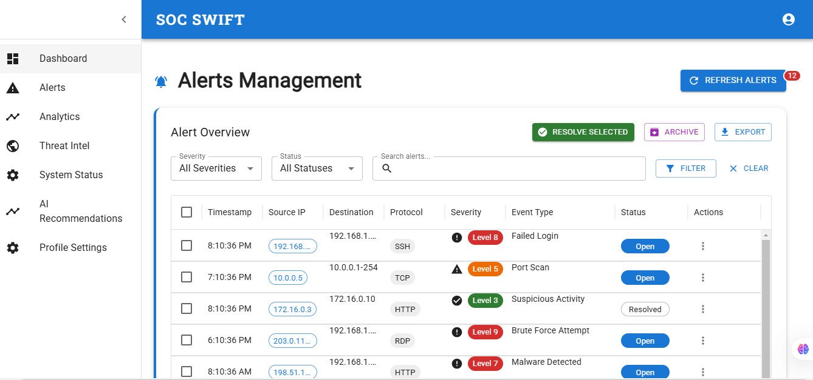

# AI-SOC-PROPTO
- Below are some of the images of live site you can preview it as well.
- I will be adding ways to integrate the ABUSEIP API into the backend of application.

---

---

---

---

---

---

